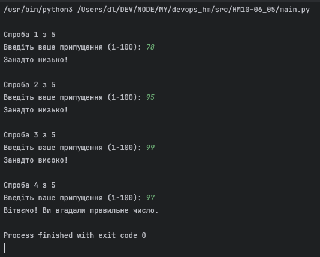

## Homework 10 — Python Number Guessing Game

### Task

Using function, write python program. The function should take input from user. Program should generates a random number between 1 and 100 and stores it in a variable. The user is asked to guess the number. If the user's guess is correct, the program should print "Congratulations! You guessed the right number." and exit. If the user's guess is incorrect, the program should provide feedback like "Too high" or "Too low" and allow the user to guess again. The user should have a maximum of 5 attempts to guess the correct number. After 5 incorrect attempts, the program should print "Sorry, you've run out of attempts. The correct number was [the correct number]" and exit.

---

### Solution

**File:** `main.py`

**Key functions:**

| Function | Purpose |
|---|---|
| `get_user_guess()` | Reads and validates an integer input from the user (1–100) |
| `play_guessing_game()` | Generates the secret number and drives the game loop (max 5 attempts) |

**Run with venv:**

```bash
# Activate virtual environment
source .venv/bin/activate

# Run the program
python main.py
```

**Result:**


