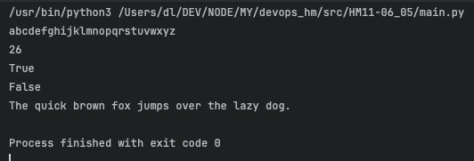

## Homework 11 — Python OOP: Alphabet Classes

### Task

Create two classes — `Alphabet` (base) and `EngAlphabet` (inherits from `Alphabet`).

**Alphabet class:** `lang`, `letters` attributes; `print()` and `letters_num()` methods.

**EngAlphabet class:** inherits `Alphabet`; private static `_letters_num = 26`; overrides `letters_num()`; adds `is_en_letter(letter)` and static `example()` methods.

**Tests (main):** create `EngAlphabet` object, print letters, count letters, check `'F'` and `'Щ'`, print example text.

---

### Solution

**File:** `main.py`

| Class | Method | Description |
|---|---|---|
| `Alphabet` | `__init__(lang, letters)` | Sets `lang` and `letters` attributes |
| `Alphabet` | `print()` | Prints all letters to console |
| `Alphabet` | `letters_num()` | Returns count of letters via `len()` |
| `EngAlphabet` | `__init__()` | Calls `super().__init__("En", "abc...xyz")` |
| `EngAlphabet` | `letters_num()` | Returns static `_letters_num = 26` |
| `EngAlphabet` | `is_en_letter(letter)` | Checks if letter is in English alphabet |
| `EngAlphabet` | `example()` | Static method — returns example English text |

**Run with venv:**

```bash
source .venv/bin/activate
python main.py
```

**Result:**


