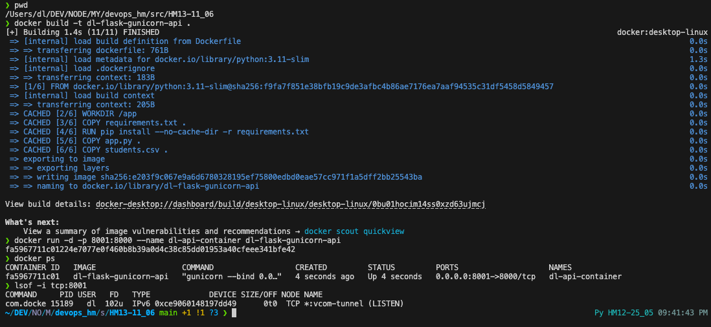
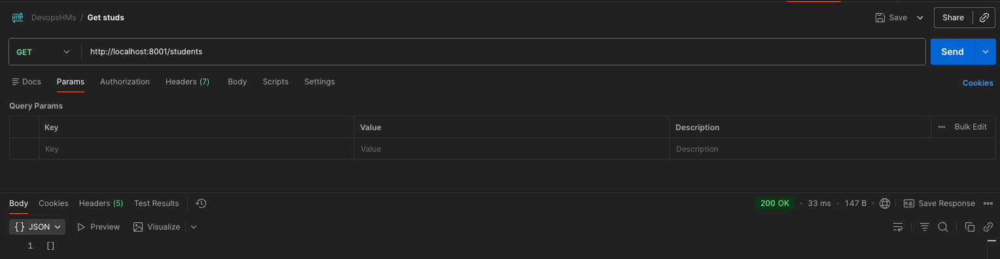
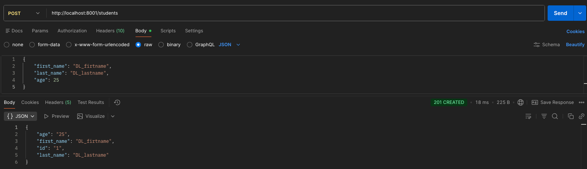
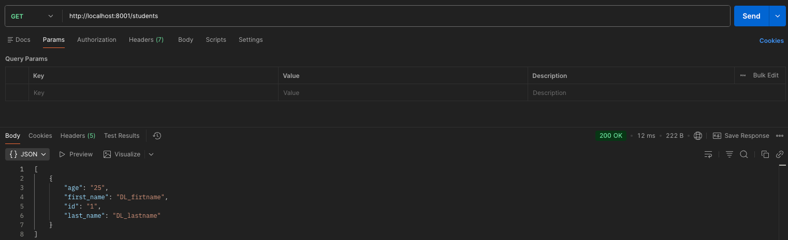

## Homework 13 — Dockerization of REST API

### Task

1. **Dockerfile**: Create a Dockerfile for the REST API from Homework 12. Run the API with Gunicorn as the web server, configured to run at `0.0.0.0:8000`.
2. **Execution**: Build the image, run the container, and demonstrate its functionality by making GET, POST, and PUT requests (using Postman or curl).
3. **Artifacts**: Submit requirements.txt, Dockerfile, .dockerignore, and execution screenshots.

---

### Solution Files

| File | Purpose | Source Code |
|:---|:---|:---|
| **Dockerfile** | Defines the container image and execution command | [Dockerfile](Dockerfile) |
| **requirements.txt** | Lists Python dependencies (Flask, requests, Gunicorn) | [requirements.txt](requirements.txt) |
| **.dockerignore** | Specifies files to exclude from the Docker build context | [.dockerignore](.dockerignore) |
| **app.py** | REST API implementation | [app.py](app.py) |

---

### Execution Results (Screenshots)

| Step                     | Description                                                        | Screenshot Placeholder                      |
|:-------------------------|:-------------------------------------------------------------------|:--------------------------------------------|
| **1. Run Container**     | Screenshot of running the container using the `docker run` command |  |
| **2. GET Request**       | GET request to Retrieve all/specific students                      |           |
| **3. POST Request**      | POST request to Create a new student                               |             |
| **4. GET after Request** | GET request to see changes                                         |         |

---

### File Configurations

#### 1. Dockerfile
```dockerfile
# Use an official Python runtime as a parent image
FROM python:3.11-slim

# Set environment variables to prevent Python from writing pyc files and buffering stdout/stderr
ENV PYTHONDONTWRITEBYTECODE=1
ENV PYTHONUNBUFFERED=1

# Set the working directory in the container
WORKDIR /app

# Copy requirements.txt to the working directory
COPY requirements.txt .

# Install dependencies
RUN pip install --no-cache-dir -r requirements.txt

# Copy the rest of the application code
COPY app.py .
COPY students.csv .

# Expose port 8000 for the Gunicorn server
EXPOSE 8000

# Command to run the Flask application using Gunicorn on port 8000
CMD ["gunicorn", "--bind", "0.0.0.0:8000", "app:app"]
```

#### 2. requirements.txt
```text
flask
requests
gunicorn
```

#### 3. .dockerignore
```text
.venv
__pycache__
*.pyc
*.pyo
*.pyd
.git
.gitignore
.dockerignore
Dockerfile
results.txt
test_requests.py
```
