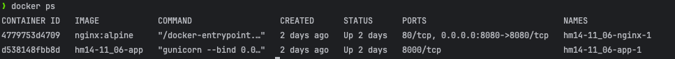
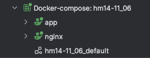
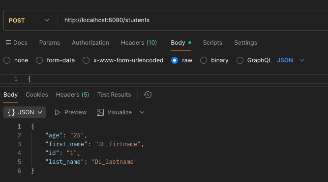
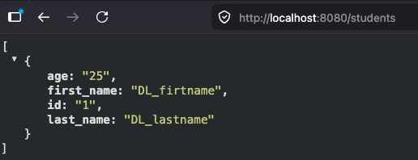

## Homework 14 — Nginx Reverse Proxy with Docker Compose

### Task

1. **Docker Compose**: Create a `docker-compose.yml` file to run two services:
   - `app`: The REST API from Homework 13 (built dynamically).
   - `nginx`: Configured as a reverse proxy to forward requests on port `8080` to the `app` service on port `8000`.
2. **Nginx Configuration**: Map the configuration file to `/etc/nginx/conf.d/default.conf` inside the Nginx container.
3. **Execution**: Verify the setup works by sending requests to Nginx on port `8080`.

---

### Solution Files

| File | Purpose | Source Code |
|:---|:---|:---|
| **docker-compose.yml** | Orchestrates the `app` and `nginx` containers | [docker-compose.yml](docker-compose.yml) |
| **default.conf** | Nginx reverse proxy configuration | [default.conf](default.conf) |
| **Dockerfile** | Python Flask app container configuration | [Dockerfile](Dockerfile) |
| **requirements.txt** | App dependencies | [requirements.txt](requirements.txt) |
| **app.py** | REST API python source code | [app.py](app.py) |

---

### Execution Results (Screenshots)

| Step                                    | Description                                                                                       | Screenshot Placeholder                                |
|:----------------------------------------|:--------------------------------------------------------------------------------------------------|:------------------------------------------------------|
| **1. Startup and Services Status**      | Screenshot of running `docker-compose up -d` and `docker-compose ps` showing both services active |      |
| **1.1 Startup and Services Status**     | Screenshot of running dockerc-compose stack via IDE plugin (network showed also)                  |   |
| **2. API Request via Postman**          | Screenshot showing the API POST works via proxy `http://localhost:8080/students`                  |   |
| **2.1 API Request via Nginx (Browser)** | Screenshot showing the API results inside a browser window at `http://localhost:8080/students`    |  |

---

### File Configurations

#### 1. docker-compose.yml
```yaml
version: '3.8'

services:
  app:
    build:
      context: .
      dockerfile: Dockerfile
    expose:
      - "8000"
    volumes:
      - ./students.csv:/app/students.csv

  nginx:
    image: nginx:alpine
    ports:
      - "8080:8080"
    volumes:
      - ./default.conf:/etc/nginx/conf.d/default.conf:ro
    depends_on:
      - app
```

#### 2. Dockerfile
```dockerfile
# Use an official Python runtime as a parent image
FROM python:3.11-slim

# Set environment variables to prevent Python from writing pyc files and buffering stdout/stderr
ENV PYTHONDONTWRITEBYTECODE=1
ENV PYTHONUNBUFFERED=1

# Set the working directory in the container
WORKDIR /app

# Copy requirements.txt to the working directory
COPY requirements.txt .

# Install dependencies
RUN pip install --no-cache-dir -r requirements.txt

# Copy the rest of the application code
COPY app.py .
COPY students.csv .

# Expose port 8000 for the Gunicorn server
EXPOSE 8000

# Command to run the Flask application using Gunicorn on port 8000
CMD ["gunicorn", "--bind", "0.0.0.0:8000", "app:app"]
```

#### 3. default.conf (nginx.conf)
```nginx
server {
    listen 8080;
    server_name localhost;

    location / {
        proxy_pass http://app:8000;
        proxy_set_header Host $host;
        proxy_set_header X-Real-IP $remote_addr;
        proxy_set_header X-Forwarded-For $proxy_add_x_forwarded_for;
        proxy_set_header X-Forwarded-Proto $scheme;
    }
}
```
