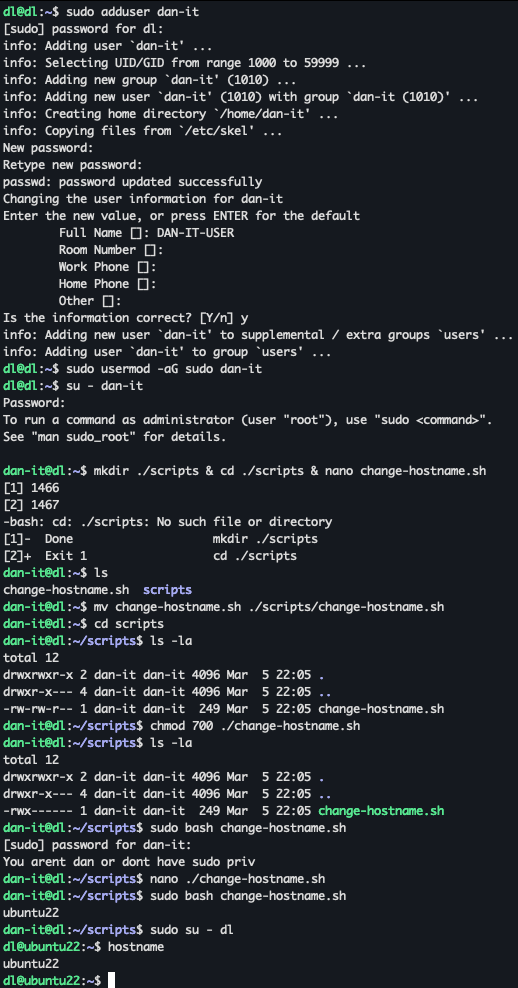
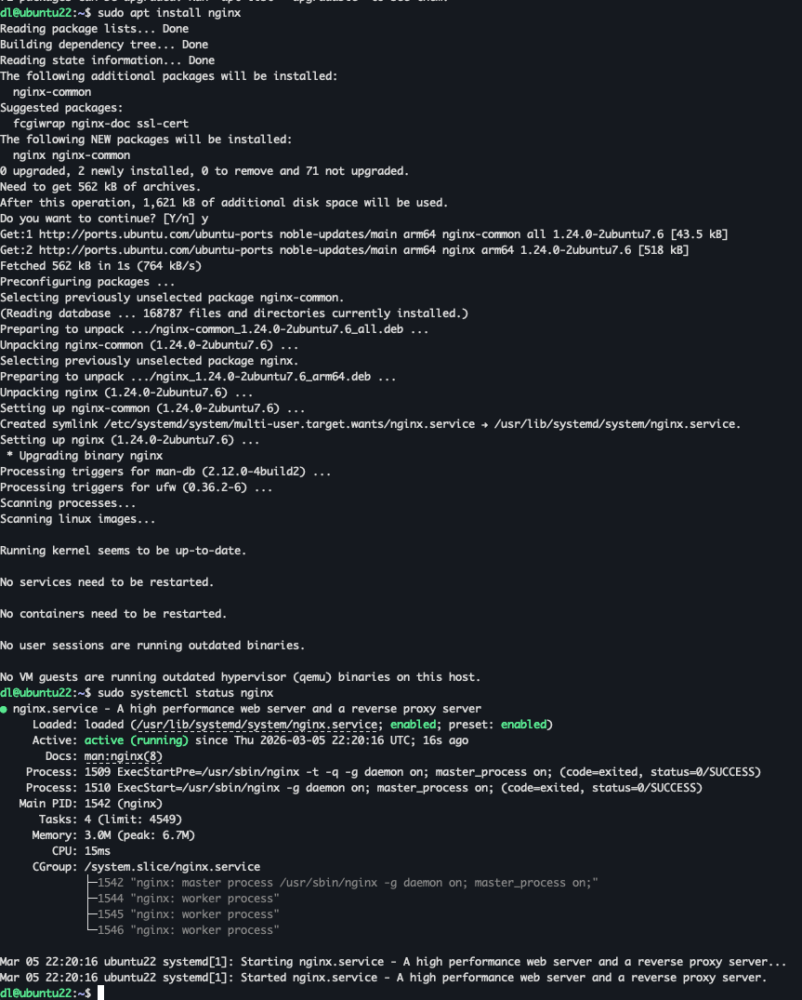
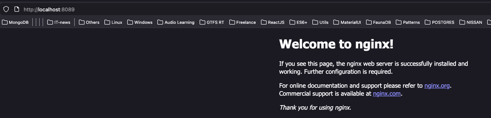
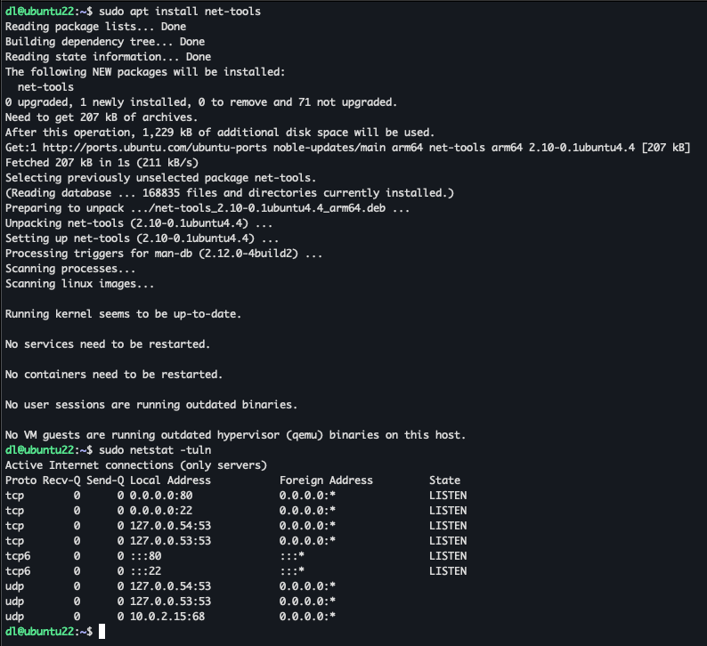

1. Створіть користувача з іменем "bob".
2. Додайте створеного користувача до групи sudo (щоб він міг виконувати команди як адміністратор). 
3. Створіть сценарій у каталозі /home/bob/, який під час виконання змінить ім'я хоста на "ubuntu22". Атрибути виконання сценарію повинні бути встановлені виключно для користувача "bob". 
4. Запустіть сценарій. Перезавантажте систему. Увійти в систему як користувач "bob". 
5. Встановіть "nginx". Перевірте, чи працює nginx, а також використайте netstat, щоб побачити, які порти відкриті.


---
## User actions

- Create user:
  ```sudo adduser dan-it```

- Added access sudo for user:
  ```sudo usermod -aG sudo dan-it```

- Go to user:
  ```su - dan-it```

- Create [Script](./change-hostname.sh) file
  ```mkdir ./scripts & cd ./scripts & nano change-hostname.sh```

- Add priv
  ```chmod 700 ./change_hostname.sh```

- Check priv
  ```ls -la```

- Run script
  ```sudo bash change-hostname.sh```

- Reload not needed. Just login by another user
  ```sudo su - dl``` or ```hostname```

### Result


---

## Nginx & Nestat

### Nginx

- Apdate cur packages: 
  ```sudo apt update```

- Install Nginx from repo:
  ```sudo apt install nginx```

- Check service: 
  ```sudo systemctl status nginx```

#### Result service status


#### Result nginx response

*BTW: 8089 port 'Cause i proxied it to my host machine 'Cause 8080 already used)*

### Netstat

- Install net-toools: 
    ```sudo apt install net-tools```

- Install net-toools:
  ```sudo netstat -tuln```

#### Result netstat

  
