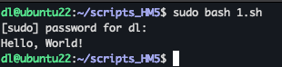
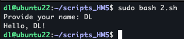
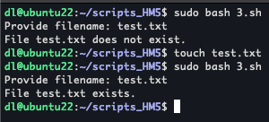
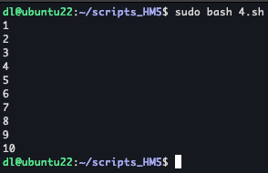
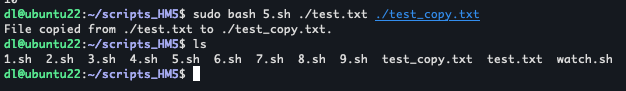
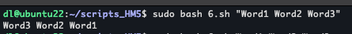
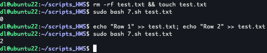
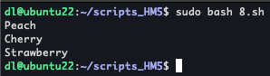
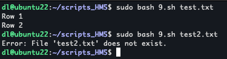
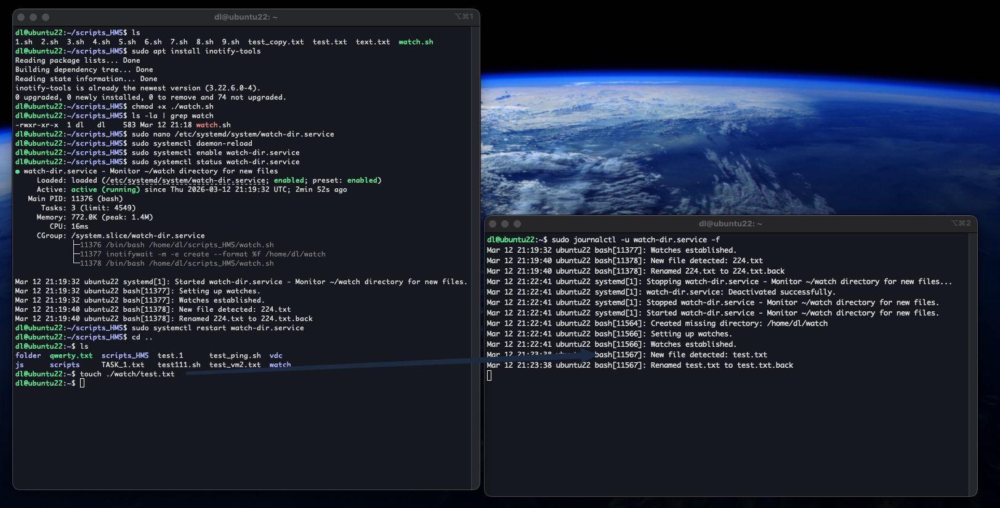

## Bash scripts

| Exercise | Description | Source Code | Execution Result |
| :--- | :--- | :--- | :--- |
| **1: Hello World** | Echoes "Hello, World!" | [1.sh](scripts/1.sh) |  |
| **2: User Input** | Asks for name and greets user | [2.sh](scripts/2.sh) |  |
| **3: Conditional Statements** | Checks if a file exists | [3.sh](scripts/3.sh) |  |
| **4: Looping** | Prints numbers 1 to 10 | [4.sh](scripts/4.sh) |  |
| **5: File Operations** | Copies file from A to B | [5.sh](scripts/5.sh) |  |
| **6: String Manipulation** | Reverses a sentence word by word | [6.sh](scripts/6.sh) |  |
| **7: Command Line Arguments** | Prints number of lines in a file | [7.sh](scripts/7.sh) |  |
| **8: Arrays** | Loops through a list of fruits | [8.sh](scripts/8.sh) |  |
| **9: Error Handling** | Reads file safely with error message | [9.sh](scripts/9.sh) |  |

## Systemd service for monitor files

| Task | Description | Files                                                                     | Execution Result                                |
| :--- | :--- |:--------------------------------------------------------------------------|:------------------------------------------------|
| **Directory Watcher** | Background service that monitors a folder for new files and automatically renames them. | [watch.sh](scripts/watch.sh)   [watch.service](services/watch.service) |  |
