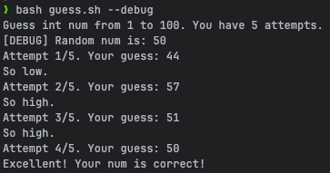
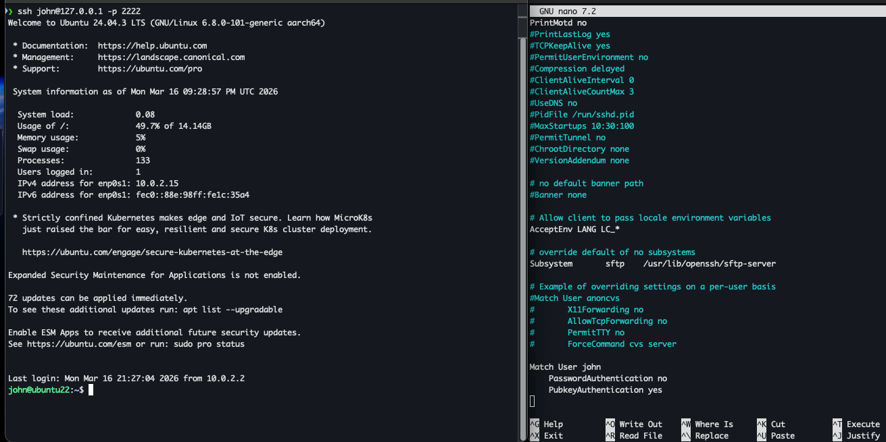
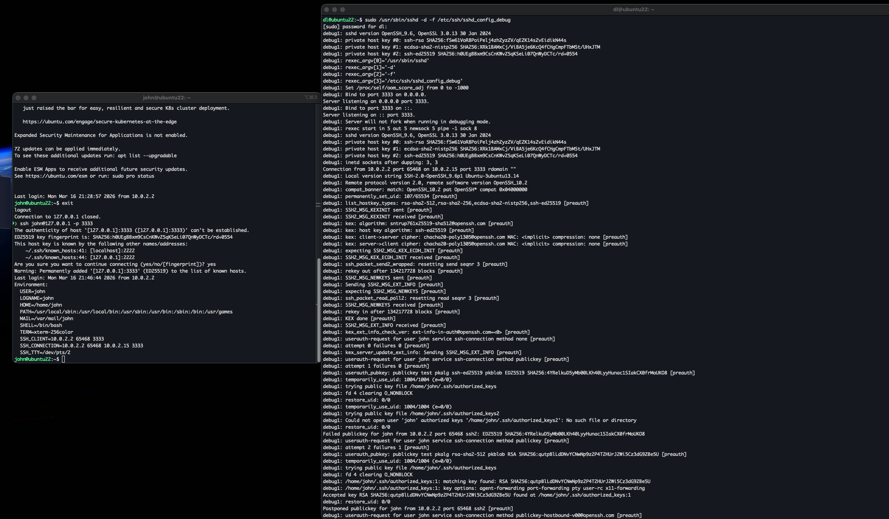
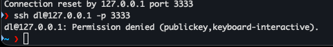
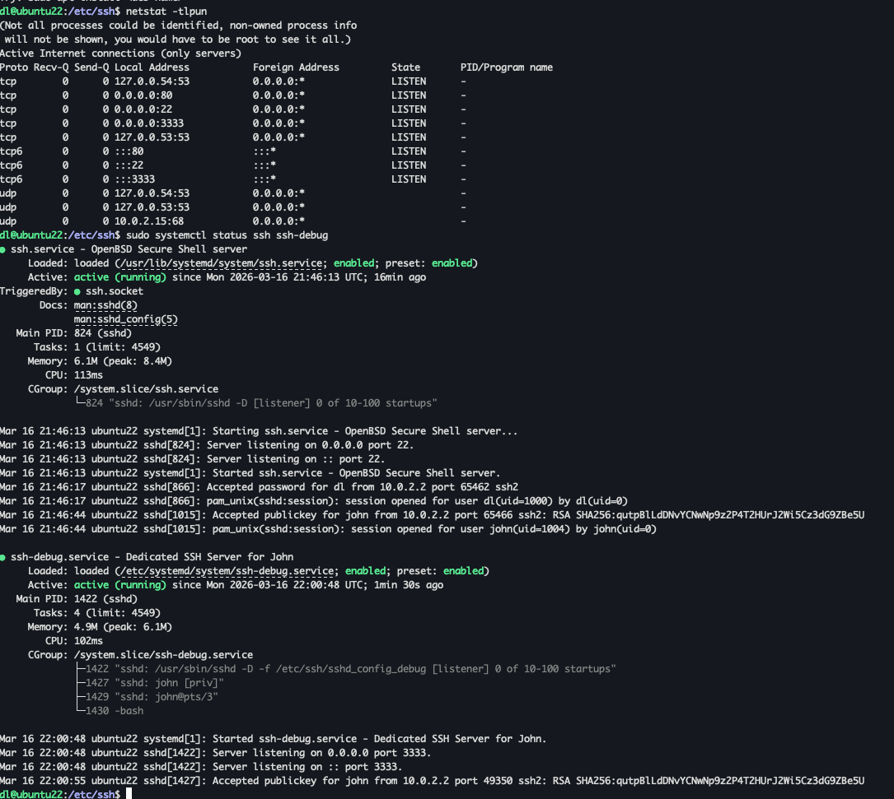

## Bash scripts

| Exercise                                   | Description                                            | Source Code                  | Execution Result               |
|:-------------------------------------------|:-------------------------------------------------------|:-----------------------------|:-------------------------------|
| **1: Random number generator and gueeser** | *run with --debug if you want to show radom num before | [guess.sh](scripts/guess.sh) |  |

## SSH
### I a little bit changed exercises, but main impact stay same 
| Exercise                                                                  | Source Code                                                                 | Execution Result                         |
|:--------------------------------------------------------------------------|:----------------------------------------------------------------------------|:-----------------------------------------|
| **1: Allow to use rsa keys for ssh connect for specific user**            | -                                                                           |     |
| **2: Start separate ssh server on debug mode only for john at 3333 port** | -                                                                           |      |
| **2.1: Check that another users is not allowed**                          | -                                                                           |  |
| **3: Start separate ssh server as a service and check status for both**   | [service](configs/ssh-debug.service), [sshd cfg](configs/sshd_config_debug) |   |
