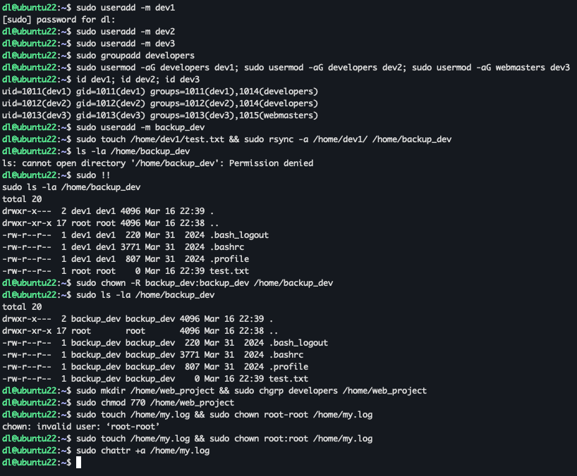
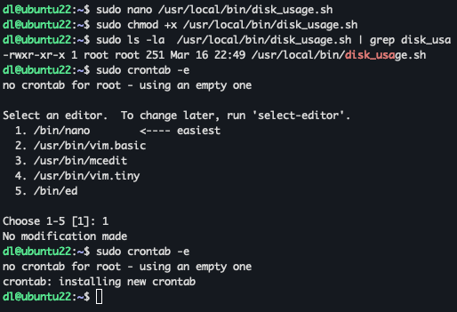
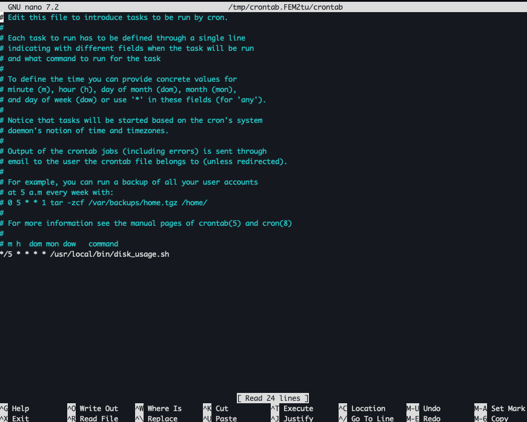
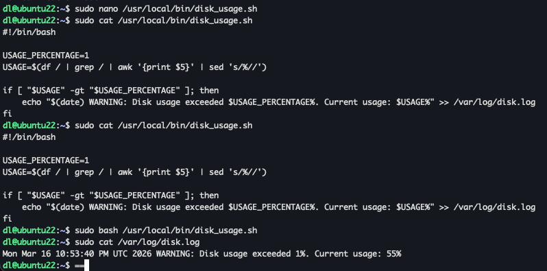
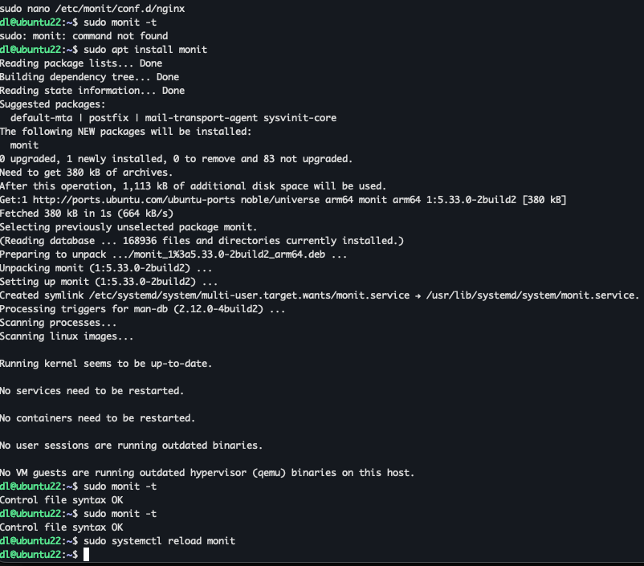
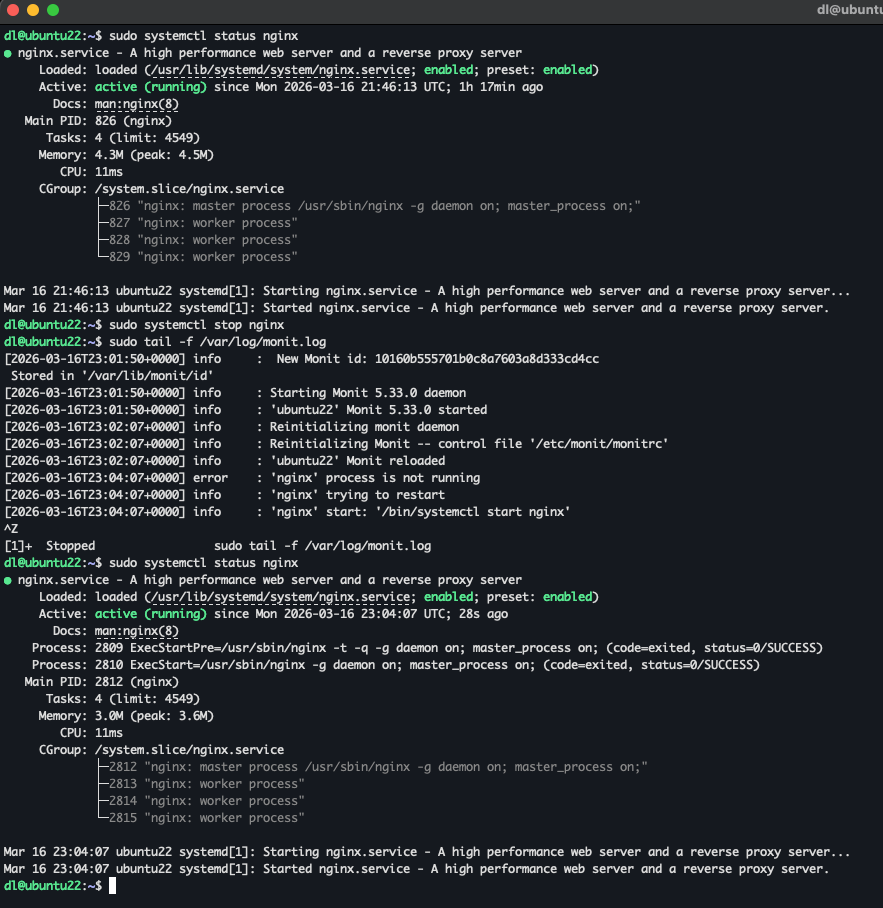

## Users & Groups

Task 1: User and Group Management

    Create User Accounts:
    Create user accounts for developers: "dev1," "dev2," and "dev3."
    Create Groups:
    Create two groups: "developers" and "webmasters."
    Assign Users to Groups:
    Add "dev1" and "dev2" to the "developers" group.
    Add "dev3" to the "webmasters" group.
    Set Default Group for Users:
    Ensure that the default group for each developer is set to "developers."
    Create Home Directories:
    Create home directories for each developer in the "/home" directory.
    Clone a User Account:
    Create a new user "backupdev" and clone the home directory of "dev1" for this user.
    Set Permissions for a Shared Project:
    Create a directory called "web_project" in "/home."
    Allow read and write access to the "developers" group.
    Immutable log file:
    Create a my.log file at /home dir, prevent anyone from writing to it except to add new content to the end of the file.

| Exercise                | Source Code | Execution Result              |
|:----------------------------------|:------------|:------------------------------|
| **1**                                                                                                           | -           |  |

## Disk utilization check

Task 2: Disk Utilization Monitoring

    Write a script and set up crontab to run this script which will check your / volume utilization and if it is higher than X percent (configurable in crontab), it will write a warning message to the log file /var/log/disk.log.

| Exercise                                                                     | Source Code                                                                 | Execution Result                          |
|:-----------------------------------------------------------------------------|:----------------------------------------------------------------------------|:------------------------------------------|
| **1: Write script and make it executable**                                   | [disk-usage.sh](scripts/disk_usage.sh)                                      |         |
| **2: Init crontab for start it each 5 min**                                  | -                                                                           |         |
| **3: Setup 1 percent to enforce debug this script manualy and check script** | -                                                                           |  |

## Monit for Nginx service

Task 3: Monit Configuration for Nginx Monitoring

    Create configuration of Monit for monitoring nginx service. Monitoring should check if the service is available on port 80 of the local host. If the service is still not available after seven checks, the monit stops restart attempts.

| Exercise                                                                     | Source Code                          | Execution Result           |
|:-----------------------------------------------------------------------------|:-------------------------------------|:---------------------------|
| **1: Install monit from repo and init configuration for nginx**              | [disk-usage.sh](configs/nginx-monit) |    |
| **2: Manualy stop nginx for check flow**                                     | -                                    |  |
