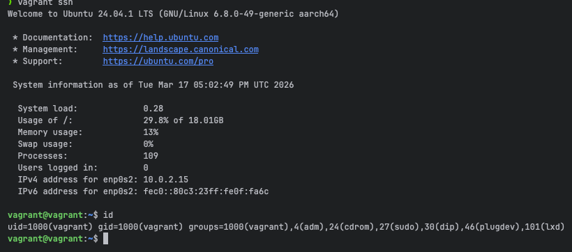
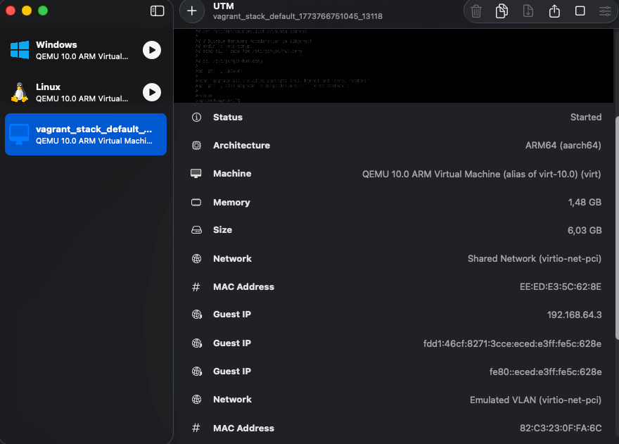
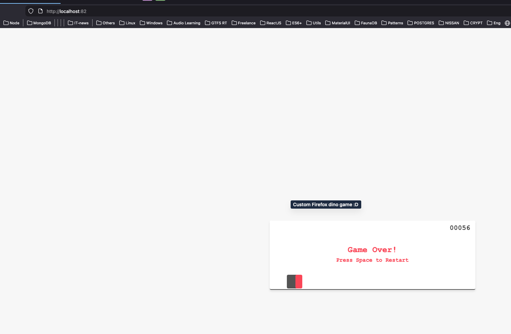
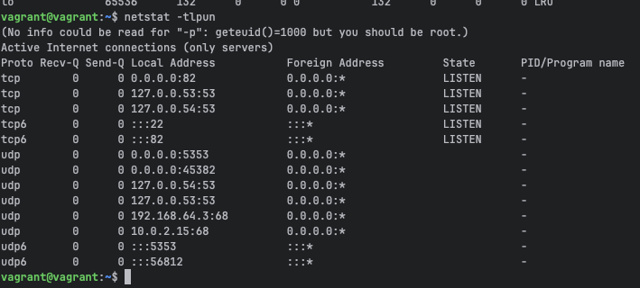

## Vagrant

Task 1: Init vm with Nginx via vagrant

    First, you need to create and init a Vagrant project. It should be an ubuntu based project. Configure the Vagrant file to spin up a single virtual machine with a public network and install nginx via provisioning. Nginx should be running on port 82 (replace port via 'sed' in provisioning). As a result, you should open the nginx page in your host browser and see the "Welcome to nginx" page. (Or you can create your own "welcome page" if you'd like :) )

| Exercise                                                                                               | Source Code                              | Execution Result                 |
|:-------------------------------------------------------------------------------------------------------|:-----------------------------------------|:---------------------------------|
| **1. Init ubuntuARM via Vagrant + UTM on Silicon**                                                     | [Vagrantfile](vagrant_stack/Vagrantfile) |    |
| **2. Make sure that VM shows on UTM**                                                                  | -                                        |  |
| **3. Make sure that nginx proxied to host on 82 port and shows as custom html start page (dino game)** | [Custom html](html/index.html)           |      |
| **3.1 Make sure that nginx listen 82 port localy on VM**                                               | -                                        |    |
| **Additional: set to .gitignore .vagrant 'Cause it local env data here (best practice issue)**         | [gitignore](../../.gitignore)            | -                                |
