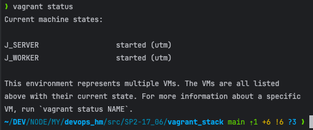
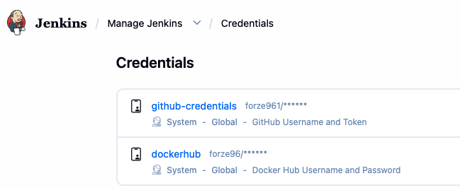
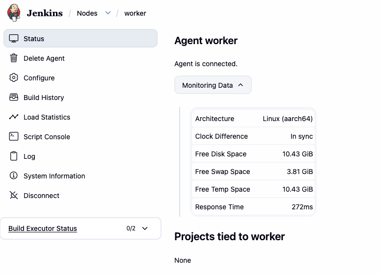
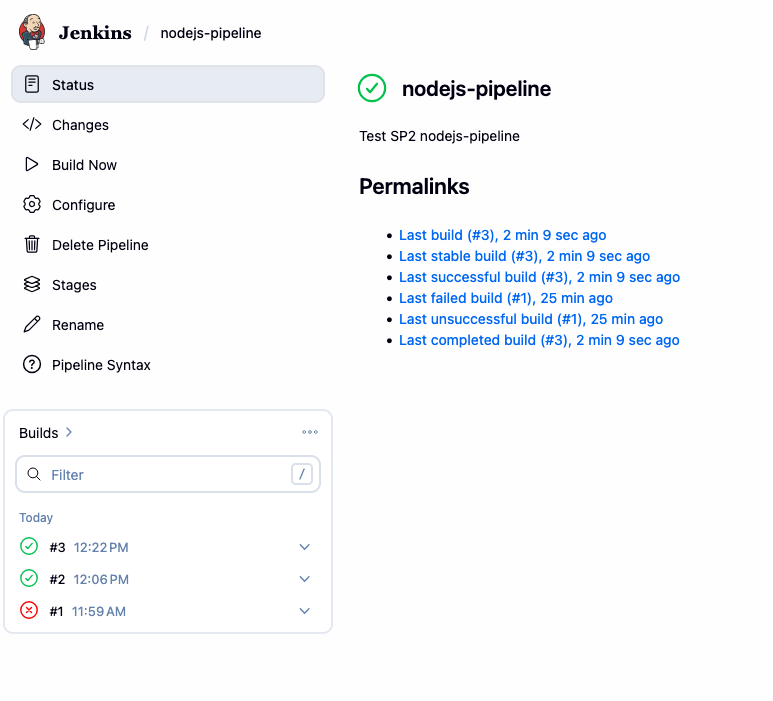
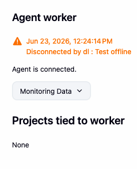
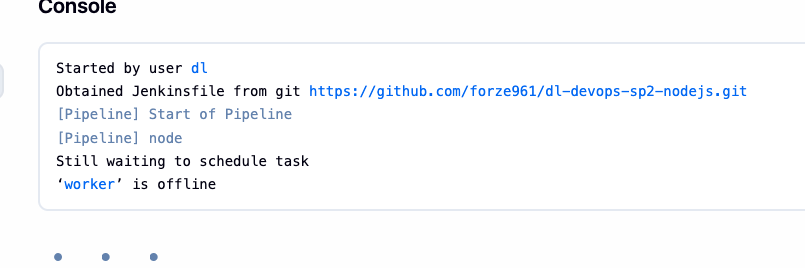
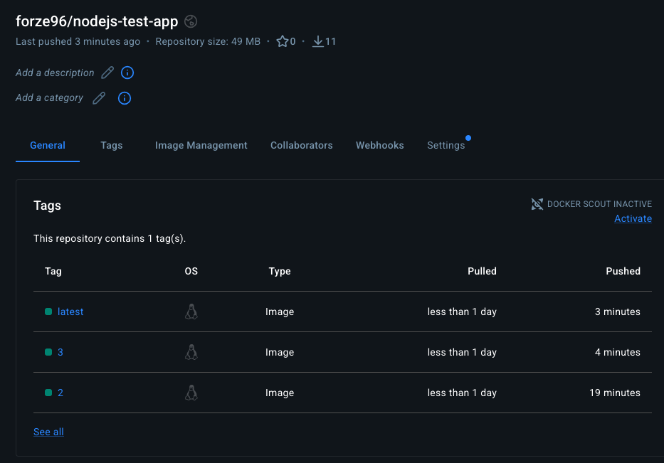

## Step Project 2 — Jenkins Master-Worker Pipeline Stack

### Task Description

1. Create two virtual machines using Vagrant (Jenkins Master and Jenkins Worker).
2. Install Docker on both and run Jenkins Master inside a Docker container.
3. Securely auto-provision Docker Hub and GitHub credentials using an initialization Groovy script on startup.
4. Connect the Jenkins Worker VM directly to the Jenkins Master.
5. Create a pipeline to pull code from SCM, compile the Docker image, run tests, login using credentials, and push it to Docker Hub if tests pass.

---

### Solution Files

| File | Purpose | Source Code |
| :--- | :--- | :--- |
| **Vagrantfile** | Configuration file to boot and configure both J_SERVER and J_WORKER VMs | [Vagrantfile](vagrant_stack/Vagrantfile) |
| **j-server.sh** | Provisioner script for Jenkins Master (installs Docker and pre-installs plugins) | [j-server.sh](vagrant_stack/entrypoint/j-server.sh) |
| **j-worker.sh** | Provisioner script for Jenkins Worker (sets up Java, Docker, and agent service) | [j-worker.sh](vagrant_stack/entrypoint/j-worker.sh) |
| **Jenkinsfile** | Pipeline configuration outlining build, test, and push steps | [Jenkinsfile](nodejs_stack/Jenkinsfile) |

---

### Execution Results (Screenshots)

| Step | Action / Verification | Screenshot                             |
| :--- | :--- |:---------------------------------------|
| **1. VM Status** | Running `vagrant status` on host to show both `J_SERVER` and `J_WORKER` VMs are active and running. |            |
| **2. Auto-Provisioned Credentials** | Inside Jenkins Credentials page, showing both `github-credentials` and `dockerhub` auto-provisioned correctly from the `.env` variables at boot. |        |
| **3. Connected Worker Agent** | Under Nodes list, showing the `worker` node is online and connected successfully. |   |
| **4. Pipeline Execution History** | The pipeline execution history showing builds #2 and #3 completed successfully. |   |
| **5. Disable Worker Node** | Making the `worker` node offline in the Jenkins UI to test execution control. |     |
| **6. Blocked Build (Offline Worker)** | Running the pipeline while the worker is offline shows the build hanging, waiting for the worker to come back online. |      |
| **7. Docker Hub Verification** | Docker Hub repositories list showing the image pushed successfully with the correct build version tag. |  |

---

## Detailed Setup Instructions (Getting Started)

### 1. Environment Setup
1. Navigate to the `vagrant_stack` folder:
   ```bash
   cd src/SP2-17_06/vagrant_stack
   ```
2. Copy the template to `.env`:
   ```bash
   cp .env.example .env
   ```
3. Edit `.env` with your GitHub and Docker Hub credentials.

### 2. Booting the Stack
Run:
```bash
vagrant up
```
This boots both machines and automatically mounts directories, configures Docker, pre-installs plugins, and creates the Groovy credential files.

### 3. Accessing Jenkins
1. Open `http://localhost:4000` in your browser.
2. Retrieve the **Initial Admin Password** from the console output (or using `vagrant ssh J_SERVER -c "sudo cat /var/jenkins_home/secrets/initialAdminPassword"`).
3. Unlock Jenkins and choose **Install suggested plugins**.
4. Create your admin user profile.

### 4. Setting up the Agent (Worker Node)
1. In Jenkins, go to **Manage Jenkins** -> **Nodes** -> **New Node**.
2. Name it `worker`, select **Permanent Agent**, and use:
   * **Remote root directory:** `/home/appuser/jenkins`
   * **Labels:** `worker`
   * **Launch method:** Launch agent by connecting it to the controller
3. Click **Save**. Copy the generated **Secret Key** from the node page.
4. SSH into the worker VM:
   ```bash
   vagrant ssh J_WORKER
   ```
5. Save the secret key and restart the service:
   ```bash
   echo "YOUR_SECRET_KEY" | sudo tee /home/appuser/jenkins/secret
   sudo systemctl restart jenkins-agent.service
   ```

### 5. Create and Run the Build & Deploy Pipeline
1. On the Jenkins home dashboard, click **New Item**.
2. Enter the name `nodejs-pipeline`, select **Pipeline**, and click **OK**.
3. Under the **Pipeline** configuration section:
   * **Definition:** Select **Pipeline script from SCM**
   * **SCM:** Select **Git**
   * **Repository URL:** Select one of the following:
     * **Local repository (recommended/default):** `/var/git/nodejs-app.git` (this local repo is populated automatically by the Vagrant server provisioner).
     * **Remote GitHub repository:** Your test GitHub repository URL (e.g. `https://github.com/forze961/dl-devops-sp2-nodejs.git`).
       * *If using a private remote repository, choose your auto-provisioned `github-credentials` in the **Credentials** dropdown menu.*
   * **Branch Specifier:** `*/main`
4. Click **Save**.
5. Click **Build Now** to execute the pipeline!
   * The pipeline will run on the `worker` agent VM. It pulls the code, builds the Docker image, runs the tests inside a temporary container, logs into Docker Hub using your credentials, and pushes the tagged image to your Docker Hub repository.
